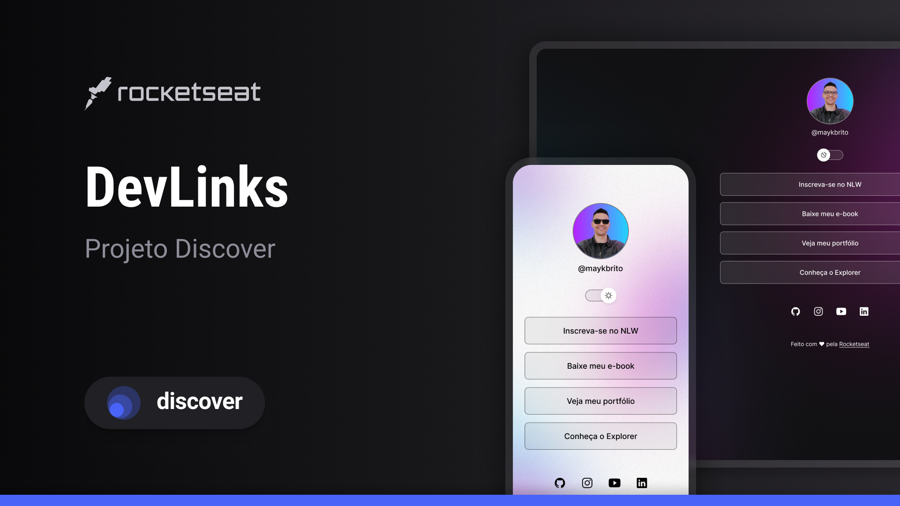

<h1 align="center"> Projeto DevLinks </h1>

Projeto do Discover na Rocket Seat conduzido com a ajuda de Mayk Brito

  <a href="#-tecnologias">Tecnologias</a>&nbsp;&nbsp;&nbsp;|&nbsp;&nbsp;&nbsp;
  <a href="#-projeto">Projeto</a>&nbsp;&nbsp;&nbsp;|&nbsp;&nbsp;&nbsp;
  <a href="#-layout">Layout</a>&nbsp;&nbsp;&nbsp;|&nbsp;&nbsp;&nbsp;
  <a href="#memo-licença">Licença</a>

  

 

  

## 🚀 Tecnologias

Esse projeto foi desenvolvido com as seguintes tecnologias:

- HTML e CSS
- JavaScript
- Git e Github
- Figma

## 💻 Projeto

O Projeto Devlinks, funciona como um portal de links onde é possivel acesso do github, perfil da Rockeat, linkedin e etc.

## 🔖 Layout

Você pode visualizar o layout do projeto através [DESSE LINK](https://www.figma.com/pt-br/comunidade/file/1187422022288947321/devlinks-projeto-discover). É necessário ter conta no [Figma](https://figma.com) para acessá-lo.

## 📜 Licença

Esse projeto está sob a licença MIT.

---

Feito com ♥ by Rocketseat 👋 [Participe da nossa comunidade!](https://discord.gg/rocketseat)
